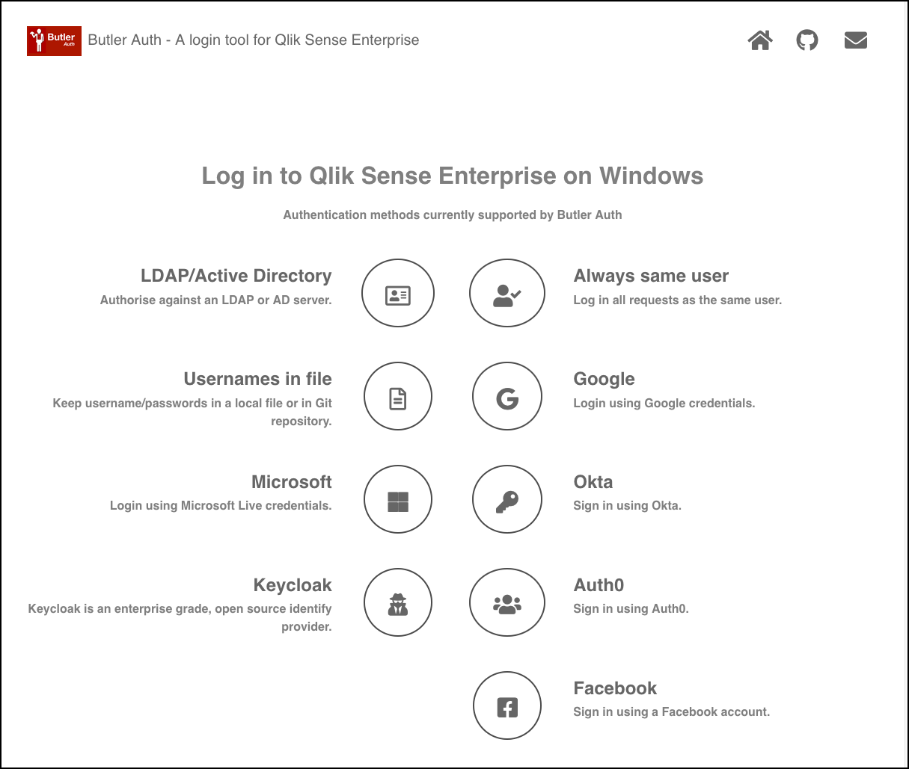

## Demo web page

Butler Auth includes a small demo web site that makes it easy to try the various authentication providers (assuming you have accounts with them, of course).

The site is just a single page with links to each authentication provider supported by Butler Auth:

**Note:**  
The demo site has hard coded links to a specific Qlik Sense Enterprise on Windows server.  
This means you can view the demo site above, but when clicking the links you won't be able to connect to the Sense server.

Instructions for customising the demo site are available [here](/docs/examples/custom-demo-site).
