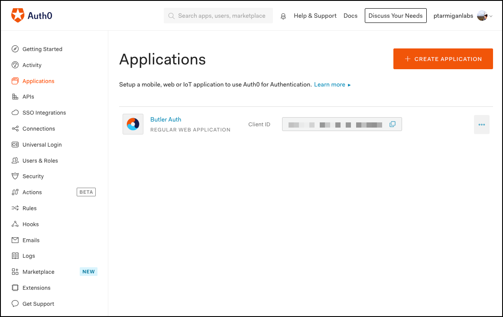
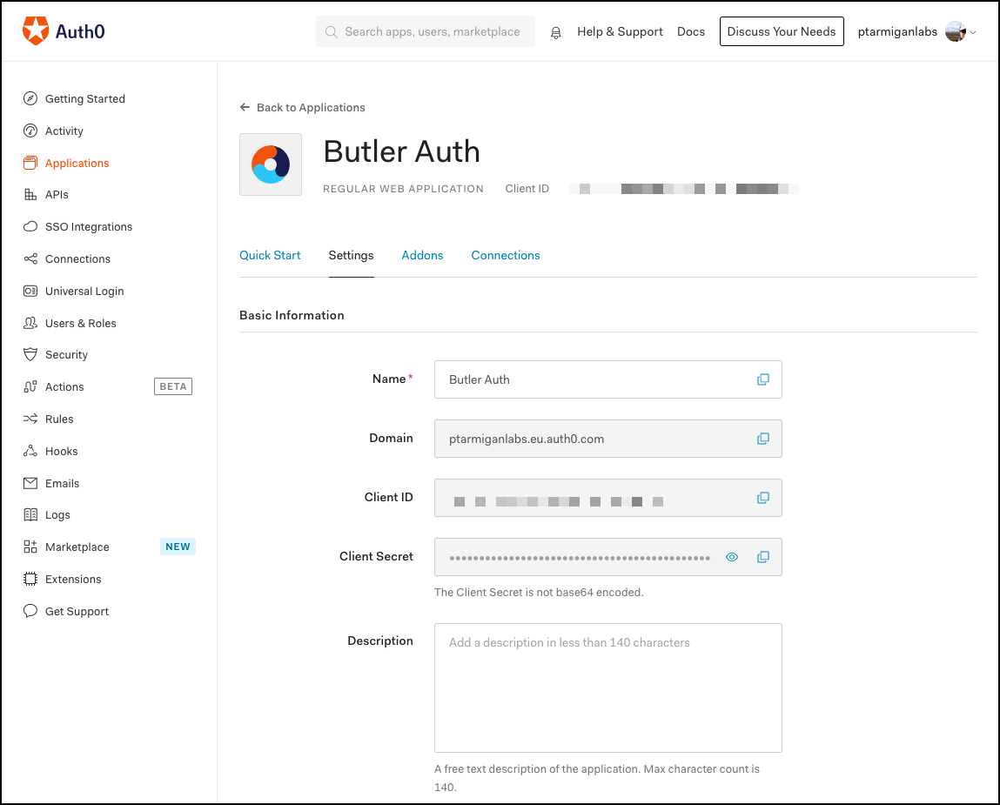
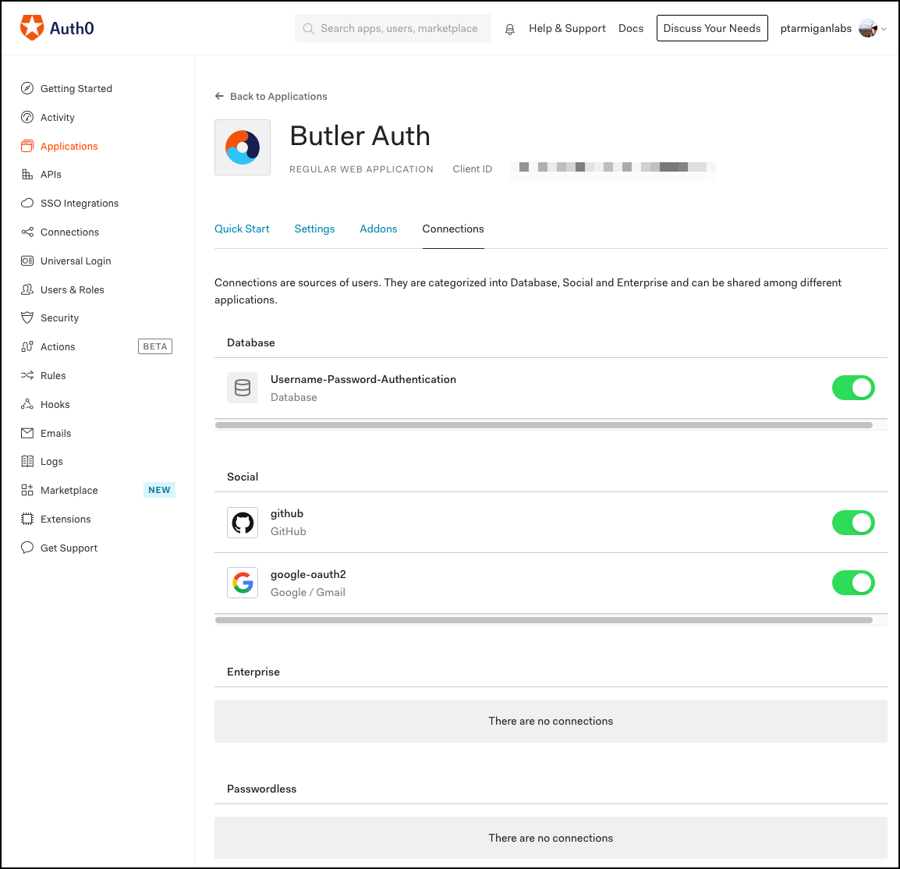

Auth0 is an interesting authentication provider in that they offer both a user directory service, but also "passthrough authentication" to other auth providers such as Google, GitHub, Microsoft etc.

It's thus possible to set up Butler Auth to work with Auth0, and then via Auth0 get access to their entire list of supported auth providers.

## Butler Auth configuration

The settings in the config file are:

```yaml
auth0:                              # "Auth0" provider
    enable: true
    userDirectory: lab              # Qlik Sense user directory that will be used for the authenticated user
    userIdShort: true               # If true, the email domain will be removed. I.e. "joe.smith@domain.com" will be changed to "joe.smith".
    issuerBaseURL: <FQDN>           # E.g. mycompany.eu.auth0.com
    baseURL: <URL>                  # FQDN of Butler Auth, e.g. https://qliksenseauth.mycompany.com:8761'
    clientId: <Client ID>
    clientSecret: <Client secret>
```

| Field | Description |
|-|-|
| enable | Enable or disable this authentication provider. true/false. |
| userDirectory | The Qlik Sense Enterprise user directory that will be used once the user has been authenticated by the authentication provider. |
| userIdShort | The provider will return the user's email address. If `userIdShort` is set to `true`, the @ character and email domain will be stripped from the email address returned by the provider. For example, "joe@company.com" would become just "joe". true/false. |
| issuerBaseURL | The URL pointing to Auth0's service. You get this from Auth0. For Ptarmigan Labs (who's located in Europe/EU), the URL could be `ptarmiganlabs.eu.auth0.com`. |
| baseURL | URL to Butler Auth. For Ptarmigan Labs this could be `https://qliksenseauth.ptarmiganlabs.net:8761` |
| clientId | Client ID from Auth0 |
| clientSecret | Client secret from Auth0 |

## Auth0 configuration

These are the general steps to set up Auth0 for use with Butler Auth.  

### Create application

1. Log in to your Auth0 dasboard ([https://manage.auth0.com/dashboard](https://manage.auth0.com/dashboard)).
2. Go to the applications section, then create a new application. You can go through the step-by-step wizard, but it's usually easier to just fill in the needed fields on the Settings tab.


3. Fill in the specifics of your application on the Settings tab. There are lots of fields here, the important ones are
   1. `Name`: Application's name. "Qlik Sense Enterprise" or "Butler Auth" could be good names, but anything goes.
   2. `Description`: Not mandatory, but it's a good idea to write down a few words what the Auth0 does and its intended use cases.
   3. `Application Logo`: If you want your users to see a logo when authentication, this is where it's set.
   4. `Application Type`: Set to "Regular Web Application".
   5. `Token Endpoint Authentication Method`: Set to "Post".
   6. `Allowed Callback URLs`: This one is important from a security perspective. Set to the fully qualified domain name (FQDN) of Butler Auth, for example `https://qliksenseauth.ptarmiganlabs.net:8761/auth/auth0/redirect`. This is a list of URLs that Auth0 is authorized to call back to once the user has been successfully authenticated.
   7. The rest of the fields on the Settings tab can be left at default values. But do review then anyway - your specific use case may require some additional settings to be set!
  
<br>

4. Move on to the Connections tab. If you have previously set up "connections" (which is Auth0's word for other authentication providers), this is where you enable them.

