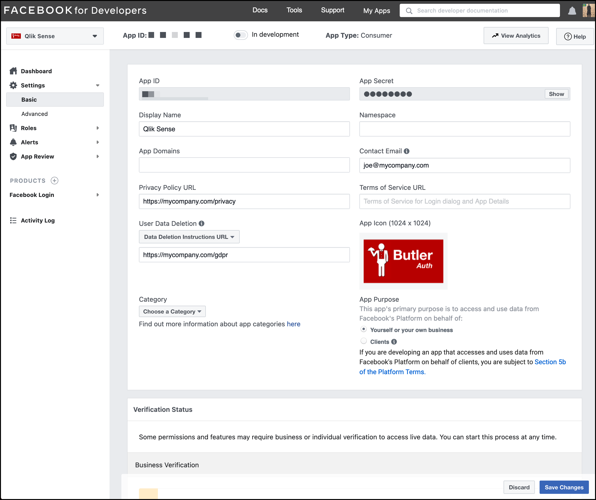

Facebook offers authentication using OAuth 2.0.

## Butler Auth configuration

The settings in the config file are:

```yaml
facebook:                           # "Facebook" OAuth2 provider
    enable: false
    userDirectory: lab              # Qlik Sense user directory that will be used for the authenticated user
    userIdShort: true               # If true, the email domain will be removed. I.e. "joe.smith@domain.com" will be changed to "joe.smith".
    clientId: <Client ID>
    clientSecret: <Client secret>
```

| Field | Description |
|-|-|
| enable | Enable or disable this authentication provider. true/false. |
| userDirectory | The Qlik Sense Enterprise user directory that will be used once the user has been authenticated by the authentication provider. |
| userIdShort | The provider will return the user's email address. If `userIdShort` is set to `true`, the @ character and email domain will be stripped from the email address returned by the provider. For example, "joe@company.com" would become just "joe". true/false. |
| clientId | Client ID from Facebook |
| clientSecret | Client secret from Facebook |

## Facebook configuration

General steps to set up Facebook Login for use with Butler Auth.

### Create application

1. Log in to Facebook's developer site [https://developers.facebook.com](https://developers.facebook.com).
2. Go to the [applications section](https://developers.facebook.com/apps/), then create a new application:  
   "Create App" > "Build Connected Experiences" > Enter app name and contact email > "Create App" > "Not a robot..".
3. Add the Facebook Login product to the newly created app:  
   Click "Set Up" on the Facebook Login product > "Other" as platform.
4. Open the basic settings:  
     

   1. Set a "Display Name".
   2. Enter a relevant "Contact Email" address.
   3. Enter a link for your "Privacy Policy URL".
   4. Enter a link to your GDPR policy (or similar).
   5. Upload an app icon. It will be shown to users when authenticating via Facebook.
   6. Review remaining fields and fill in as needed for your specific use case.
5. Copy the `App ID` and `App Secret` from the screen above to the Butler Auth config file.
