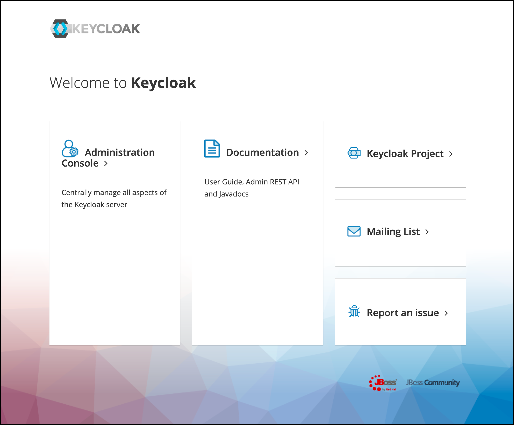
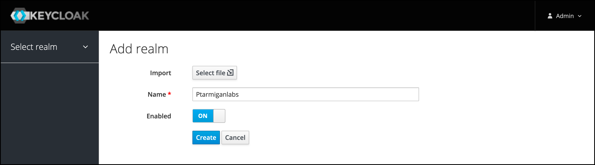
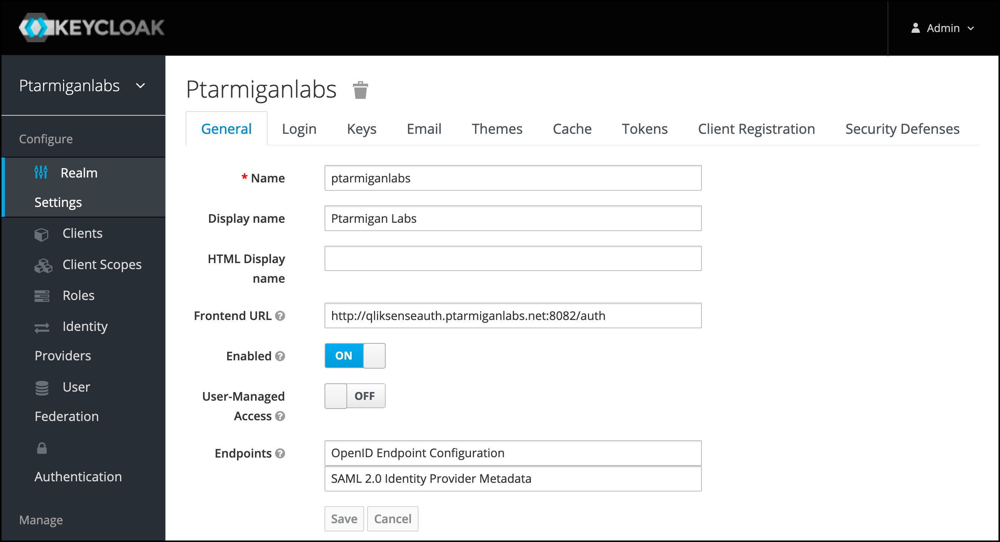
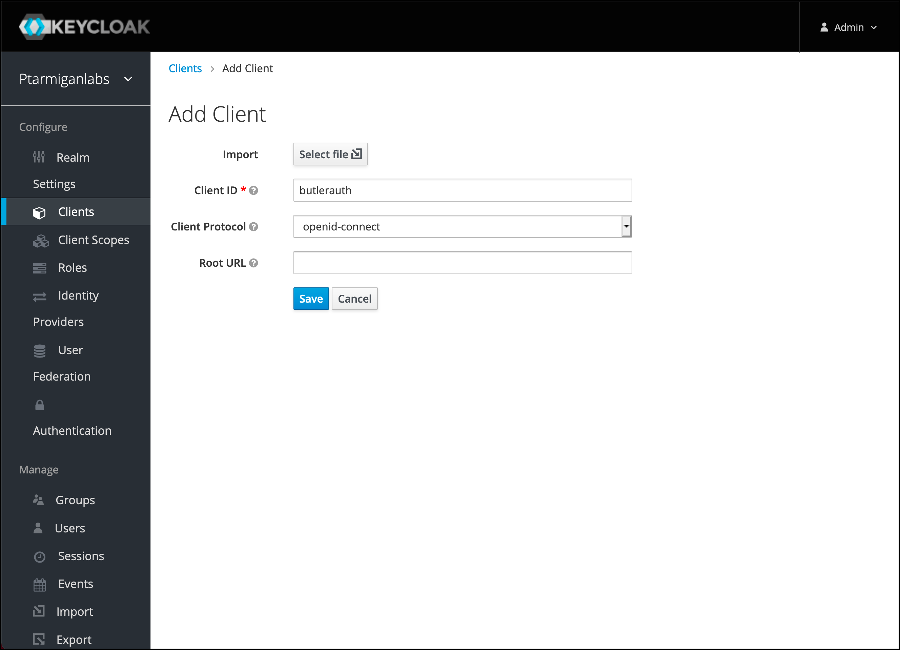
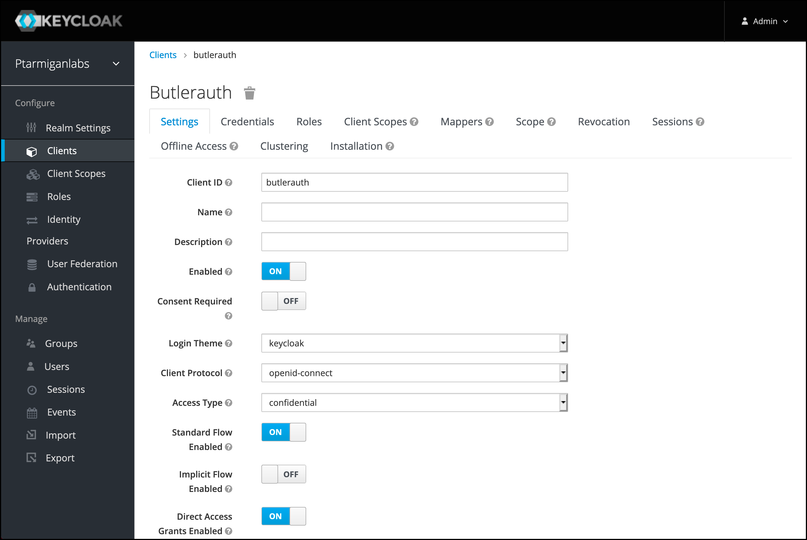
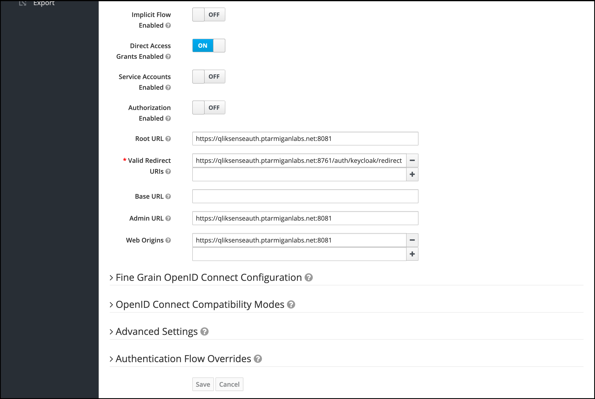
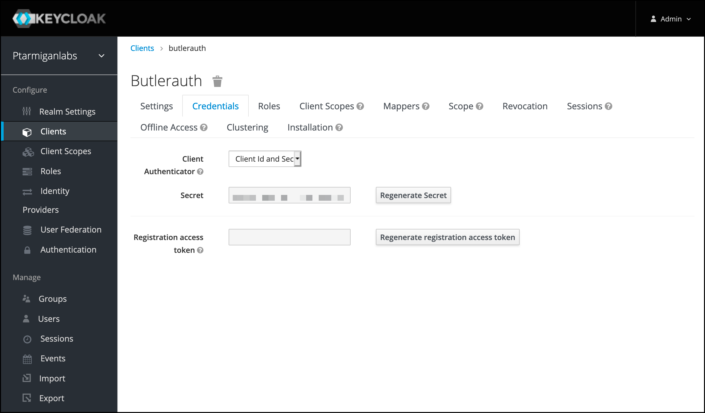
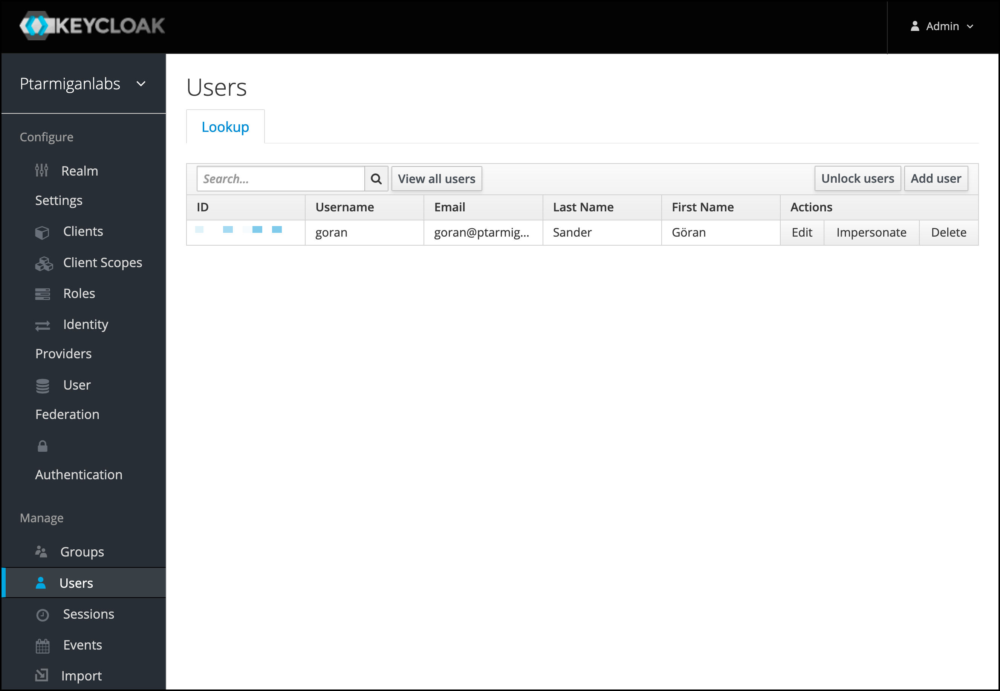
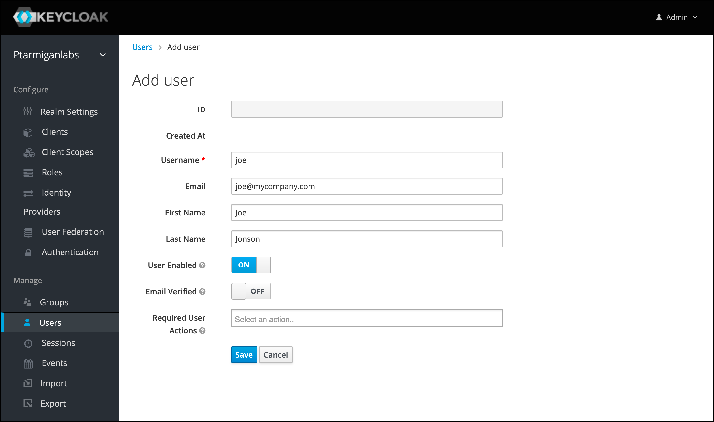

## Butler Auth configuration

The settings in the config file are:

```yaml
keycloak:                           # "Keycloak" provider
    enable: true
    userDirectory: lab              # Qlik Sense user directory that will be used for the authenticated user
    userIdShort: true               # If true, the email domain will be removed. I.e. "joe.smith@domain.com" will be changed to "joe.smith".
    clientId: <Client ID>
    clientSecret: <Client secret>
    host: <FQDN of Keycloak server> # E.g. https://keycloak.mydomain.com
    realm:                          # E.g. ptarmiganlabs
    authorizationURL: <URL>         # E.g. https://keycloak.mydomain.com/auth/realms/<myrealm>/protocol/openid-connect/auth
    tokenURL: <URL>                 # E.g. https://keycloak.mydomain.com/auth/realms/<myrealm>/protocol/openid-connect/token
    userInfoURL: <URL>              # E.g. https://keycloak.mydomain.com/auth/realms/<myrealm>/protocol/openid-connect/userinfo
```

| Field | Description |
|-|-|
| enable | Enable or disable this authentication provider. true/false. |
| userDirectory | The Qlik Sense Enterprise user directory that will be used once the user has been authenticated by the authentication provider. |
| userIdShort | The provider will return the user's email address. If `userIdShort` is set to `true`, the @ character and email domain will be stripped from the email address returned by the provider. For example, "joe@company.com" would become just "joe". true/false. |
| clientId | Client ID from Keycloak's `*realm*` > `Clients` > `*client*` > `Settings` page. |
| clientSecret | Client secret from Keycloak's `*realm*` > `Clients` > `*client*` > `Credentials` page. |
| host | Full URL to Keycloak |
| realm | Keycloak realm to use. |
| authorizationURL | See below for instruction on how to get this. |
| tokenURL | See below for instruction on how to get this. |
| userInfoURL | See below for instruction on how to get this. |

## Keycloak configuration

General steps to set up Keycloak for use with Butler Auth.  

In the examples below Keycloak is available at `http://qliksenseauth.ptarmiganlabs.net:8082`.  
This works for demonstration purposes, but in a production scenario https should be used.

1. Log in to the Keycloak admin console.
   
2. If you don't already have a Keycloak *realm*, create one via the menu in the upper left corner.
   
3. Fill in the realm settings. The screen shots below only gives some guidance, you are ***STRONGLY*** encouraged to review all settings. The `Frontend URL` is the URL where Butler Auth will call Keycloak.
   
4. Open the `Clients` menu on the left. Add a new one.
   
5. Fill in the details of the new client.
   

   ... and lower part of that page...  
   The `Valid Redirect URIs` is a list of approved/allowed sources. Only calls originating from these URIs will be handled by this Keycloak realm/client.  
   In our case, this is the callback URL of Butler Auth.
   
6. The `Credentials` tab contains the Client secret that should be copied to Butler Auth.
   
7. The settings on the remaining tabs of the client configuration are used to fine-tune the authentication setup. The default values should work as a starting point though.
8. If you don't already have any users in Keycloak it's easy to set up one for testing purposes.
   Open the `Users` menu on the left. Click the `Add user` button in upper right corner. 
   

   

### Keycloak Identity Brokering

Keycloak has a cool feature similar to the one offered by [Auth0](/docs/examples/auth-providers/auth0), where you can use another, 3rd party identity provider for the actual authentication work.

For example, you can set up Butler Auth to use Keycloak (and have all the benefits offered by Keycloak), and then have Keycloak forward the authentication requqests to IdPs such as Microsoft, Google, Facebook, LinkedIn, Twitter, GitHub and others. 