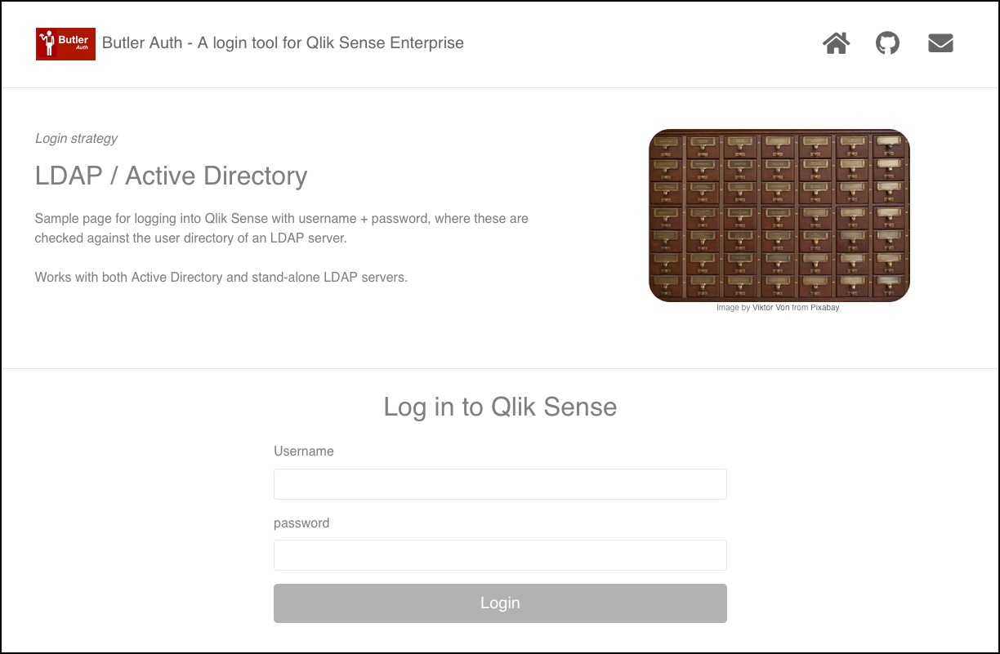

## Butler Auth configuration

The settings in the config file are:

```yaml
ldap:                               # "LDAP" provider
    enable: false
    url: https://<FQDN>:8081        # URL where login UI for this provider is available
    userDirectory: lab              # Qlik Sense user directory that will be used for the authenticated user
    ldapServer:                     # Information about the LDAP server to authenticate against
        host: <ldap(s)://ldap.mydomain.com>    # Both normal (ldap://) and secure (ldaps://) LDAP is supported
        port: 636                   # Usually 389 for LDAP and 636 for LDAPS
        bindUser: '<domain\username>'       # Service account used to log into the LDAP server
        bindPwd: <password>         # Password of service account
        searchBase: '<dc=...,dc=...,dc=...>'    # Base path from which authentication attempts will start
        searchFilter: '(&(objectcategory=person)(objectclass=user)(|(samaccountname={{username}})(mail={{username}})))' # Filter used to get info about users in LDAP server
        tls: 
            # Settings here will override default TLS behaviour. 
            # Useful for example if your cert is for another domain wrt the host name of the LDAP server.
            # If a setting is empty it will simply be ignored by Butler Auth.

            # Necessary if the LDAP server isusing a self-signed certificate
            # Should point to a PEM coded CA certificate file.
            ca: 
```

| Field | Description |
|-|-|
| enable | Enable or disable this authentication provider. true/false. |
| url | Tells Butler Auth where it should send the user when it's time to enter his/her username and password. A basic web page for entering LDAP credentials is included in Butler Auth, but for production scenarios you probably want to create your own login page. |
| userDirectory | The Qlik Sense Enterprise user directory that will be used once the user has been authenticated by the authentication provider. |
| host | Host where LDAP server is running. `ldap://ldap.mydomain.com` is insecure/not encryptet, `ldaps://ldap.mydomain.com` is secure. Use ldaps if possible.
| port | Port to use on LDAP server. Usually 636 for ldaps, 389 for ldap. |
| bindUser | User to log in with on LDAP server. Usually a service account of some kind. |
| bindPwd | Password for bindUser. |
| searchBase | The base path from which authentication attempts will be done. For an Active Directory domain called `sales` at company `mycompany.com` it could be `dc=sales,dc=mycompany,dc=com'` |
| searchFilter | Filter used to determine if a user exists in the LDAP server. The example above should be a good starting point for standard-install Active Directory servers. |
| ca | If ldaps is used and the LDAP server is configured with proper certificates that use publicly recognizable certificate authorities, this `ca` section is not needed. If self-signed certificates are used you need to specify the CA certificate here for ldaps to work.  |

### Using Butler Auth's built-in login page

If you want to use the built-in login page to begin with, it's configured like this:

1. Let's assume Butler Auth is hosted at https://butlerauth.company.com, with the http server set up to listen on port 8081.  
The demo web UI showing all the authentication providers is then available at https://butlerauth.company.com:8081/auth-providers.html.
2. In order to use the demo login page you should set the `ButlerAuth.authProvider.ldap.url` to `https://butlerauth.company.com:8081`

Here is the built-in LDAP login page:



## LDAP configuration

Configuring the directory server (which Butler Auth talks to using the LDAP protocol) is beyond the scope of this site.
