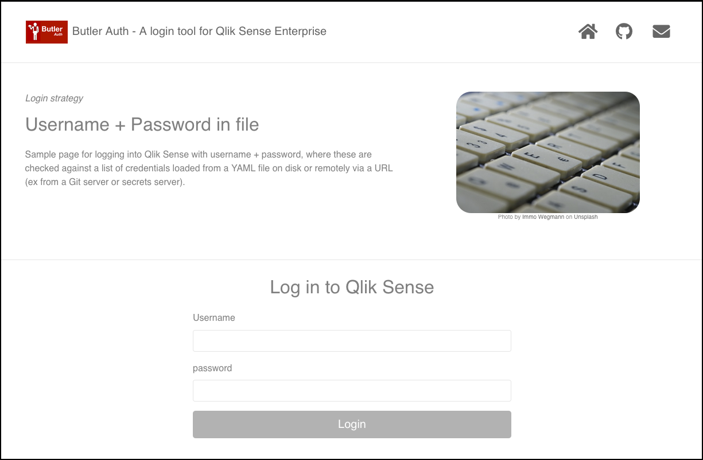

## Butler Auth configuration

The settings in the config file are:

```yaml
localFile:                          # "Local file" provider reads user data from a file on disk
    enable: false                    
    url: https://<FQDN>:8081        # URL where login UI for this provider is available
    userDirectory: lab              # Qlik Sense user directory that will be used for the authenticated user
    userFile: ./config/users.yaml   # YAML file containing usernames and passwords
```

| Field | Description |
|-|-|
| enable | Enable or disable this authentication provider. true/false. |
| url | Tells Butler Auth where it should send the user when it's time to enter his/her username and password. A basic web page for entering local-file credentials is included in Butler Auth, but for production scenarios you probably want to create your own login page. |
| userDirectory | The Qlik Sense Enterprise user directory that will be used once the user has been authenticated by the authentication provider. |
| userFile | A YAML file containing usernames and passwords. |

### Using Butler Auth's built-in login page

If you want to use the built-in login page to begin with, it's configured like this:

1. Let's assume Butler Auth is hosted at https://butlerauth.company.com, with the http server set up to listen on port 8081.  
The demo web UI showing all the authentication providers is then available at https://butlerauth.company.com:8081/auth-providers.html.
2. In order to use the demo login page you should set the `ButlerAuth.authProvider.localFile.url` to `https://butlerauth.company.com:8081`

Here is the built-in local file login page:



## Userfile format

The file containing user credentials is YAML-formatted:

```yaml
users:
  - username: anna
    fullName: Anna Svenson
    password: aaa
    comment: Root admin user
  - username: joe
    fullName: Joe Jonson
    password: bbb
    comment: Regular user
```

{}
Make sure to secure this file properly.

Anyone with access to this file can log into Qlik Sense as any of the users in the file.
{}
