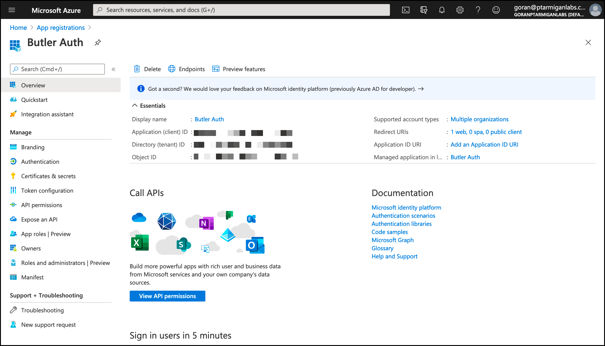
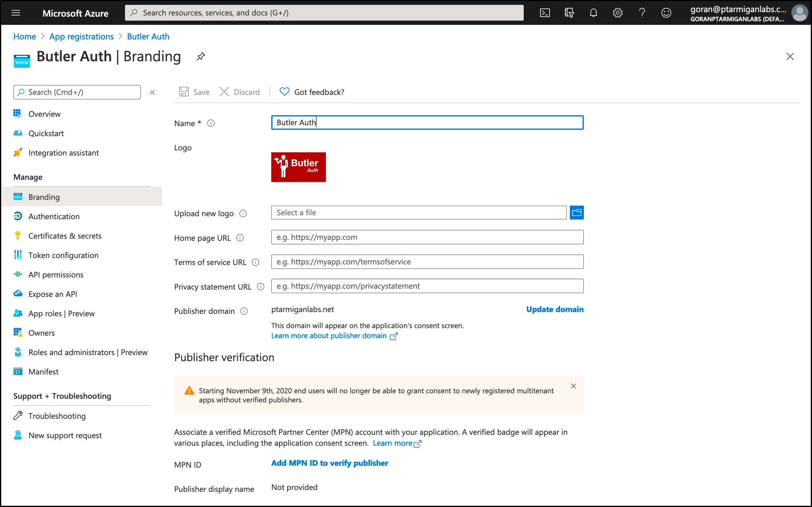
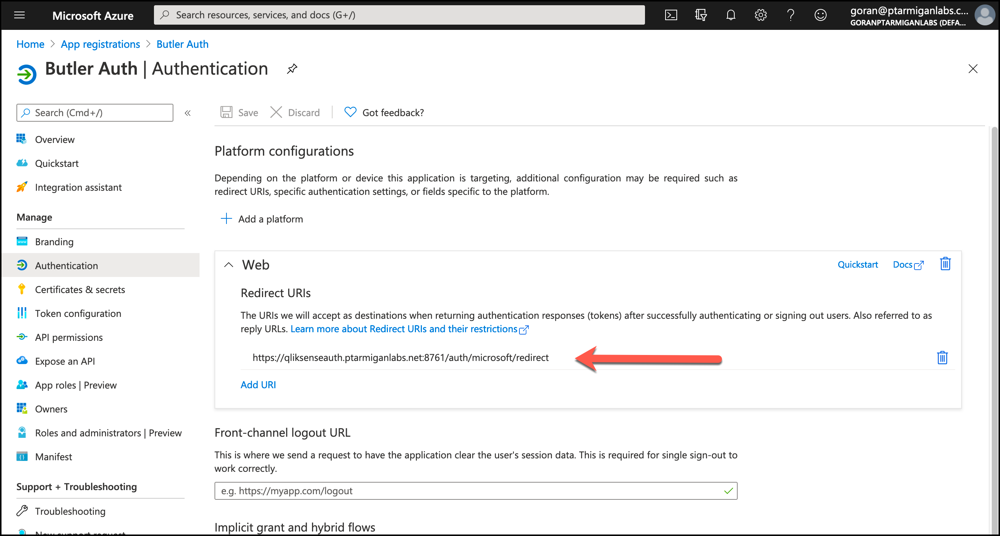
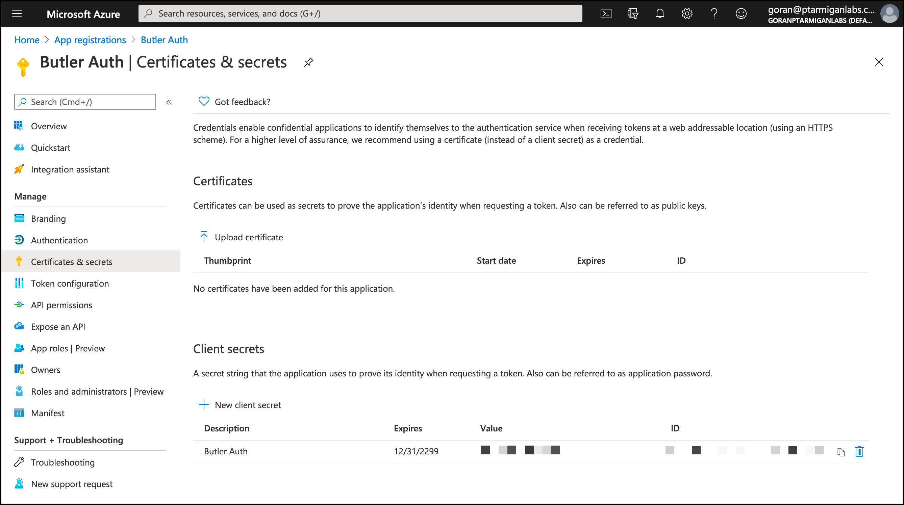

## Butler Auth configuration

The settings in the config file are:

```yaml
microsoft:                          # "Microsoft" OAuth2 provider
    enable: false
    userDirectory: lab              # Qlik Sense user directory that will be used for the authenticated user
    userIdShort: true               # If true, the email domain will be removed. I.e. "joe.smith@domain.com" will be changed to "joe.smith".
    clientId: <client ID>
    clientSecret: <Client>
```

| Field | Description |
|-|-|
| enable | Enable or disable this authentication provider. true/false. |
| userDirectory | The Qlik Sense Enterprise user directory that will be used once the user has been authenticated by the authentication provider. |
| userIdShort | The provider will return the user's email address. If `userIdShort` is set to `true`, the @ character and email domain will be stripped from the email address returned by the provider. For example, "joe@company.com" would become just "joe". true/false. |
| clientId | Client ID from Microsoft |
| clientSecret | Client secret from Microsoft |

## Microsoft configuration

These are the general steps to set up Microsoft for use with Butler Auth.  

1. Log in to the [Miceosoft Azure portal](https://portal.azure.com).
2. Go to the [App registrations](https://portal.azure.com/#blade/Microsoft_AAD_RegisteredApps/ApplicationsListBlade) page.
3. The screen shots below show a minimum configuration - you should review all fields to make sure the configuration is correct for your specific use case.

   On the *application overview* tab you find the Client ID, among other things.
   

   On the *Branding tab* you can upload an image that's shown when users authenticate.
   

   On the *Authentication tab* you set the Redirect URIs. This is the URL where Butler Auth is running, appended with "/auth/microsoft/redirect".
   

   On the *Secrets tab* you find the Client secret that should be copied to the Butler Auth config file.
   
