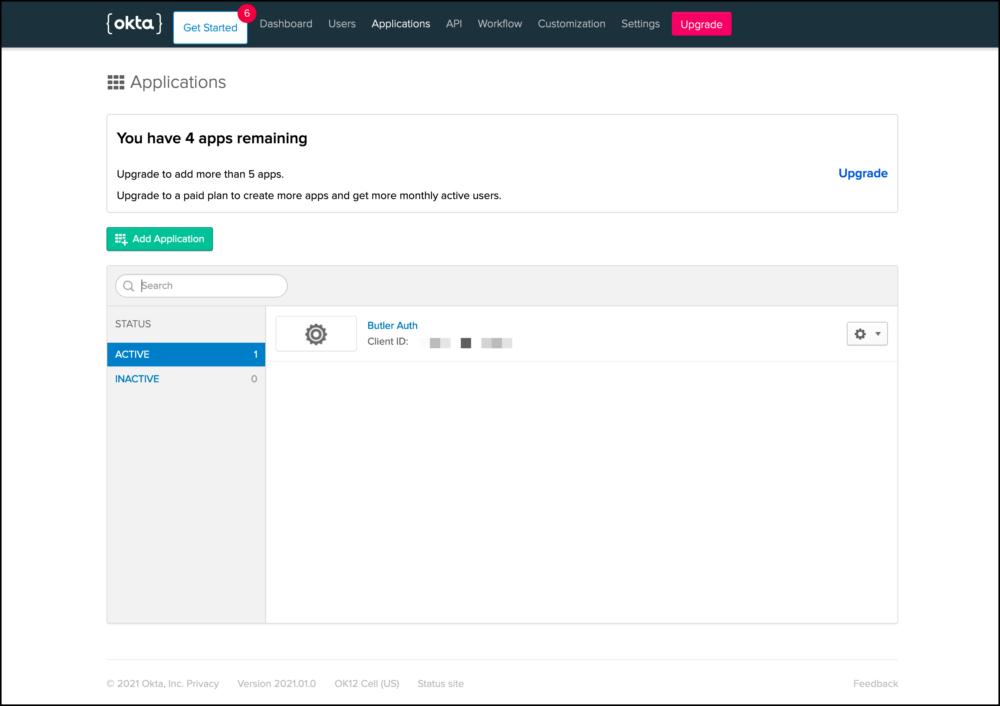
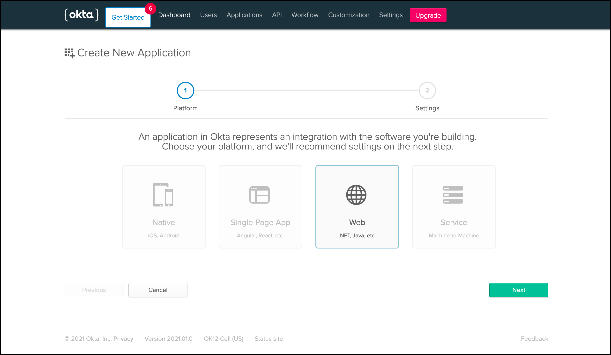
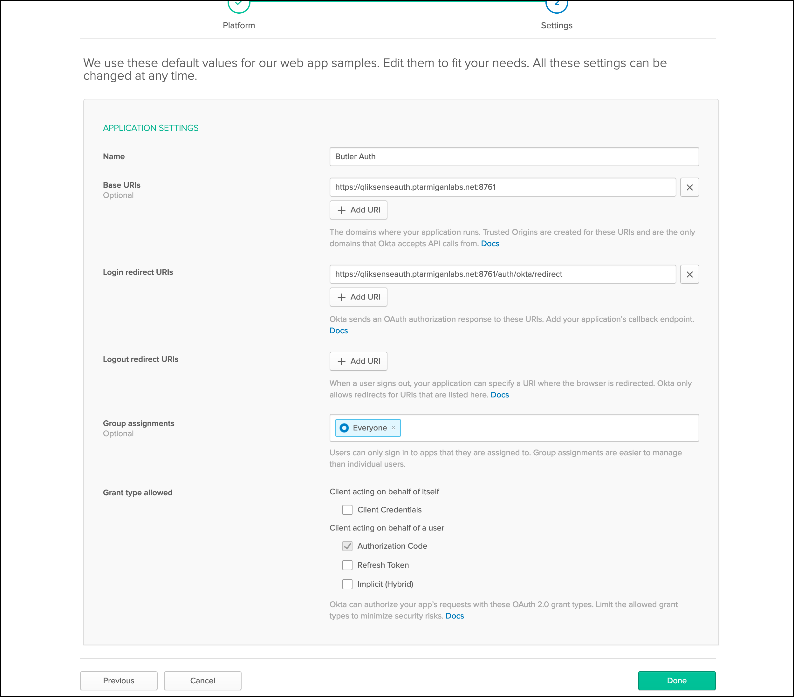
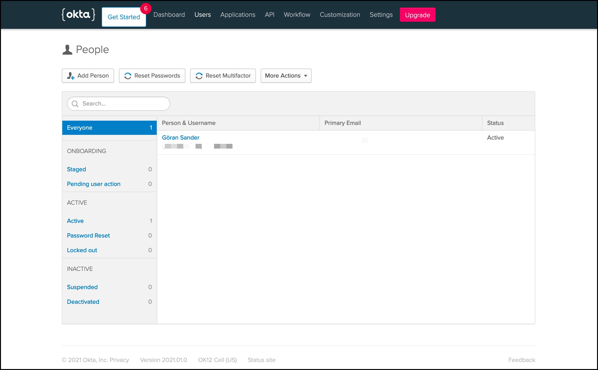

## Butler Auth configuration

The settings in the config file are:

```yaml
okta:                               # "Okta" provider
    enable: false
    userDirectory: lab              # Qlik Sense user directory that will be used for the authenticated user
    userIdShort: true               # If true, the email domain will be removed. I.e. "joe.smith@domain.com" will be changed to "joe.smith".
    clientId: <Client ID>
    clientSecret: <Client secret>
    oktaDomain: <Okta domain from Google admin console>  # E.q. https://myid-123456.okta.com'
    idp: 
```

| Field | Description |
|-|-|
| enable | Enable or disable this authentication provider. true/false. |
| userDirectory | The Qlik Sense Enterprise user directory that will be used once the user has been authenticated by the authentication provider. |
| userIdShort | The provider will return the user's email address. If `userIdShort` is set to `true`, the @ character and email domain will be stripped from the email address returned by the provider. For example, "joe@company.com" would become just "joe". true/false. |
| clientId | Client ID from Okta |
| clientSecret | Client secret from Okta |
| oktaDomain | The URL you get from Okta. Usually something like "sometext.okta.com |
| idp | Can usually be left blank. |

## Okta configuration

These are the general steps to set up Okta for use with Butler Auth.  
In the screen shots below Okta's free tier is used - things might look different for you.

1. Sign into [Okta](https://www.okta.com/). Go to the `Applications` tab:
   
2. Create a new "Web" application and give it a good name:
   

   Fill in `Name`, `Base URIs` (which is the Butler Auth URL) and `Login redirect URIs` (which is Butler Auth's Okta  callback URL). Review the other fields to make sure they match your use case. Click `Done`.
   
3. Add users as needed.
   
