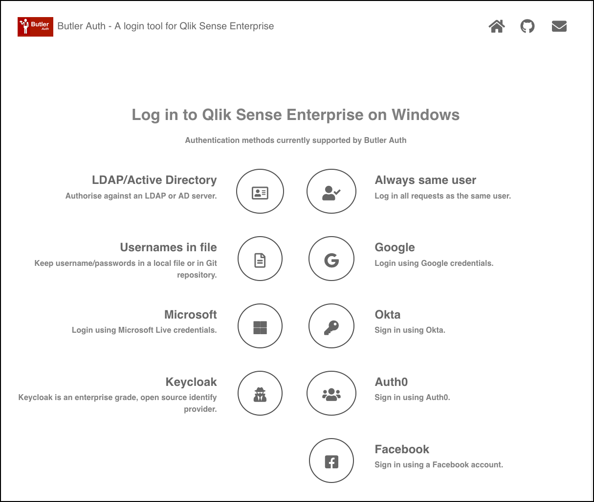
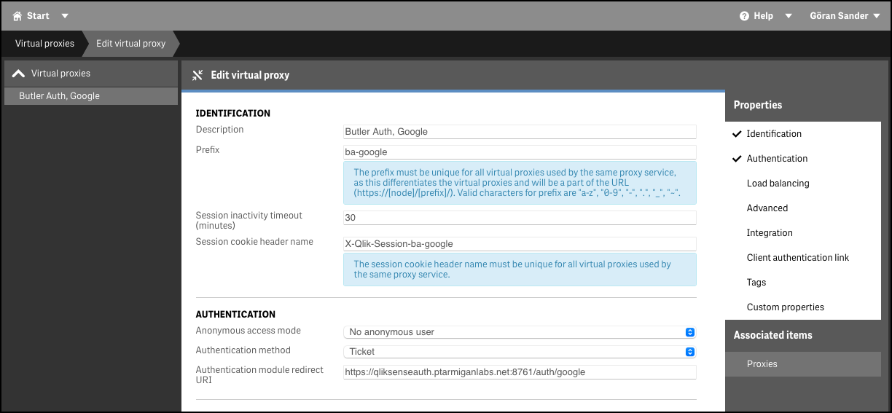
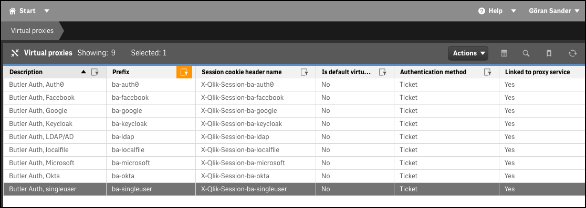

## Butler Auth demo site

A single web page provides an easy way to try out the different auth providers: 



## The demo site - how does it work?

Each auth provider included on the demo site has a link that takes the user to Qlik Sense.
For example, clicking the Google icon the user will be sent to `https://senseprod.ptarmiganlabs.net/ba-google`.  

senseprod.ptarmiganlabs.net is a Qlik Sense Enterprise on Windows server, with a virtual proxy called `ba-google` (hint: ba=butlerauth).

That virtual proxy has the usual settings plus a link to a "authentication module" that should be used.



The authentication module is - surprise - part of Butler Auth. More specifically the REST API of Butler Auth has an endpoint named `/auth/google`.  
With Butler Auth's REST API being hosted at `https://qliksenseauth.ptarmiganlabs.net:8761` (this is all set in the main config file), the full URL for the virtual proxy's authentication module is `https://qliksenseauth.ptarmiganlabs.net:8761/auth/google`.

## Customizing the demo site

The list below should be a good starting point if you want to customize the demo site to your own server/network/Qlik Sense environment.

### Configure http server

Butler Auth's build in web server is always enabled, but must be configured.  
Given the config below the web server will be running at `https://qliksenseauth.ptarmiganlabs.net:8081`.

https is enabled using the specified certificate/key. In this case the certificate is not password protected (the password field is empty).

```yaml
ButlerAuth:
    server:
        web:                        # The web/http server used to serve the sample login pages included in Butler Auth
            host: qliksenseauth.ptarmiganlabs.net   # Hostname of the http server. Would be container name when running under Docker. 
            port: 8081              # Port where the http server will listen
            tls:                    # Used to secure the http server with TLS. I.e. https.
                enable: true
                cert: /path/to/cert/cert.cer
                key: /path/to/cert.key
                password: 
```

### Create Qlik Sense virtual proxies

You can have many virtual proxies in Qlik Sense, even if you have just a single Sense server.  
Each virtual proxy implements exactly one authentication method, or uses anonymous access to Sense.

If you want to try all the auth providers offered by Butler Auth, you need to create one virtual proxy for each provider:



An example of a virtual proxy configuration for Google authentication is found up above on this page.

### Modify demo site

The demo site is included in the GitHub repository and in the image on Docker Hub. It's located at `/src/html` in the GitHub repository.

The html pages are reasonably basic, but a general understanding of html, css and Javascript is needed to understand how they work.

The pages only use paths relative to the http server's base URL, meaning that the pages *should* work in your Sense environment without any changes. You might want to change look-and-feel etc though - feel free to use the provided pages as inspiration!
