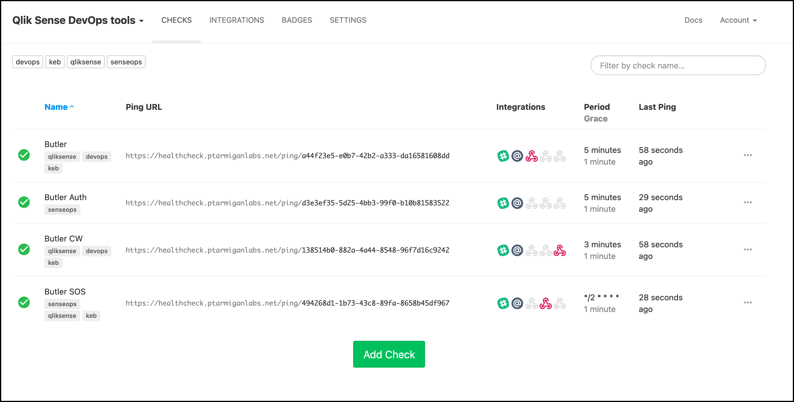
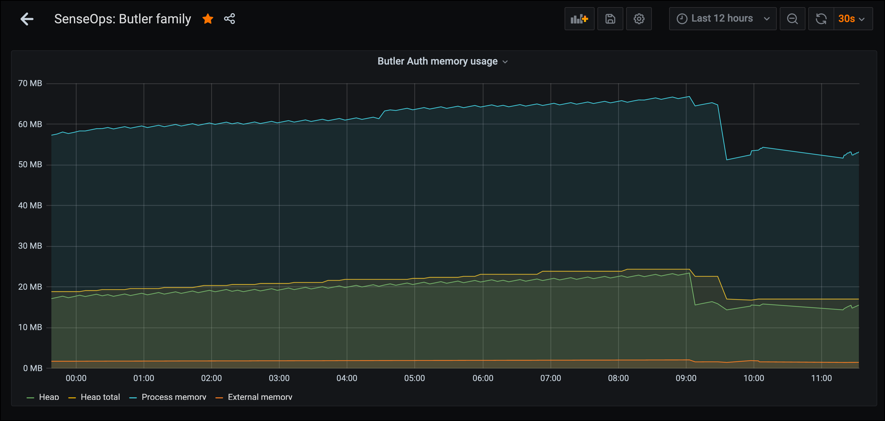

## Heartbeats

Butler Auth has an optional heartbeat feature, which when enabled will call a specific URL with a configurable interval.

A typical scenario is to use a monitoring tool such as [Healthchecks.io](https://healthchecks.io/) to ensure that the heartbeats arrive on schedule.  
That tool can then alert if the heartbeats don't arrive on time.  
Healthchecks.io is available both as a Docker image for self-hosting and as a SaaS offering.

Configuration of heartbeats is described [here](/docs/getting-started/setup/config-file/config-file-sections/20-heartbeat/).

Here is a self-hosted Heahlthcheck.io instance used to monitor the Butler family of tools:

## Uptime monitor with metrics in InfluxDB

Another aspect of monitoring is to keep track of the internals of the service in question.

Butler Auth's "uptime monitor" is an optional feature that can be [enabled in the config file](/docs/getting-started/setup/config-file/config-file-sections/40-uptime-monitor/).

When enabled it will send metrics on how much memory Butler Auth uses to an InfluxDB database, as well as logging these metrics to the log files.  
Logging to InfluxDB and log files can be individually enabled/disabled.  
Once the metrics are in InfluxDB then can be viewed using Grafana:

## Docker healthcheck

The main config file has [options for enabling Docker healthchecks](/docs/getting-started/setup/config-file/config-file-sections/30-docker-healtcheck/).  
If running Butler Auth in Kubernetes this feature can useful when setting up custom avaialability logic for K8s containers.
