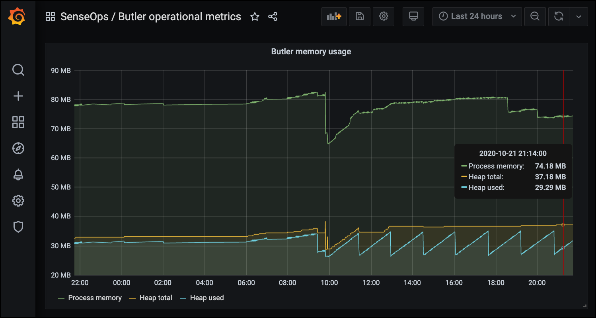

## Running Butler Auth

How to start and keep Butler Auth running varies depending on whether you are using Docker or a native Node.js approach.

### Running as a Docker container

Starting Butler Auth is easy.  
First configure the `docker-compose.yml` file as needed, then start the Docker container in interactive mode (with output sent to the screen). This is useful to ensure everything works as intended when first setting up Butler Auth.

    docker-compose up

Once everything works as intended, hit `ctrl-c` to stop the service.  
Then start it again in deameon (background) mode:

    docker-compose up -d

From here on the Docker enviromment will make sure Butler is always running, including restarting it if it for some reason stops.

### Running as native Node.js app

Starting Butler Auth as a Node.js task is easy too:

    d:
    cd \node\butler-auth\src
    node index.js

It is of course also possible to put those commands in a command file (.bat on Windows, .sh etc on other platforms) file and execute that file instead.

#### Windows services & process monitors

As Butler Auth is the kind of service that (probably) should always be running on a server, it makes sense using a Node.js process monitor to keep it alive (if running as a Docker container you get this for free).

On Windows you can use the excellent [Nssm](https://nssm.cc/) tool to make Butler Auth run as a Windows Service, with all the benefits that follow (can be monitored using operations tools, automatic restarts etc).

If running Butler Auth as a Node.js app on Linux, [PM2](https://github.com/Unitech/pm2) and [Forever](https://github.com/foreverjs/forever) are two good process monitors.

### Monitoring Butler Auth

Once Butler Auth is running it's a good idea to also monitor it. Otherwise you stand the risk of not getting notified if it for some reason misbehaves.

Butler Auth will log data on its memory usage to InfluxDB if

1. The config file's `ButlerAuth.uptimeMonitor.enable` and `ButlerAuth.uptimeMonitor.storeInInfluxdb.enable` properties are both set to `true`.
2. The remaining InfluxDB properties of the config file are correctly configured.

Assuming everything is correctly set up, you can then create a Grafana dashboard showing Butler Auth's memory use over time.  
You can also set up alerts in Grafana if so desired, with notifications going to most IM tools and email.

The following metrics are logged to InfluxDB, in a measurement called `butlerauth_memory_usage`:

* heap_used
* heap_total
* external
* process_memory

Each measurement is also tagged with a tag called `butlerauth_instance`. This tag is set in the main config file and is used in complex environments to separate between different Butler Auth instances.

A Grafana dashboard can look like this. Note that one of the available metrics (`external`) is not used in this particular dashboard. It's still logged to InfluxDB though.

  

There is a [sample Grafana dashboard](https://github.com/ptarmiganlabs/butler/tree/master/docs/grafana) in Butler's GitHub repo.
