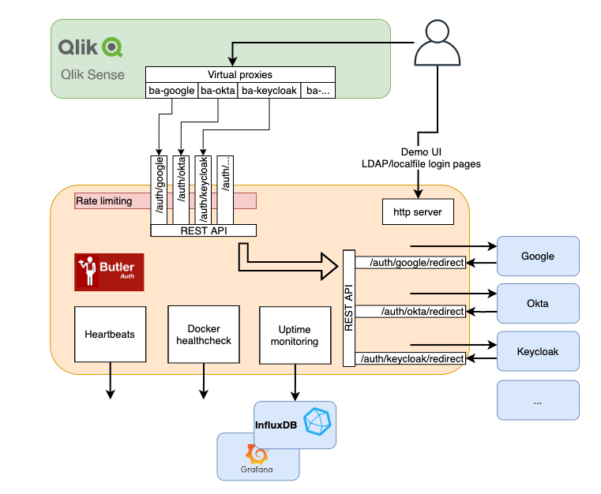

The goal of the Butler Auth project is to make it easy to add strong/flexible/custom authentication strategies to Qlik Sense Enterprise on Windows (QSEoW).  

QSEoW has very good, built-in ***access control*** and ***authorization***.  
In practice this means that QSEoW enforces that users only can access resources they are allowed to access.

There is however no ***authentication*** what so ever in QSEoW.  
This is quite reasonable - Qlik Sense is an analytics tool and should focus on this rather than the intricancies of ensuring that users are who they claim to be. That job is better left to those specializing in that particular field.

***Butler Auth is the link between QSEoW and services that specialize in authentication and security.***

## Technology stack

Butler Auth is written in [Node.js](https://nodejs.org/en/) and runs on most modern operating systems.  
Some authentication providers are developed as part of the Butler Auth project, but most come from [Passport.js](/docs/reference/passport.js/).

You can run Butler Auth on the same server as Qlik Sense, in a Docker container on a Linux server, in Kubernetes, on Mac OS, on Raspberry Pi (not a good idea.. but possible and proven to work).

Butler Auth is a member of a group of tools collectively referred to as the "Butler family", more info [here](/docs/about/butler-family).

This picture might be useful to understand what Butle Auth does and how it fits into the larger system map around Qlik Sense:

  
